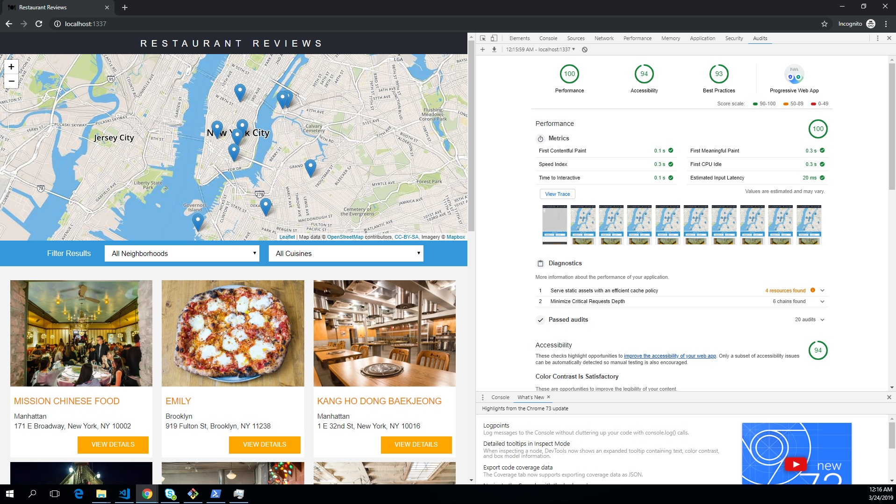
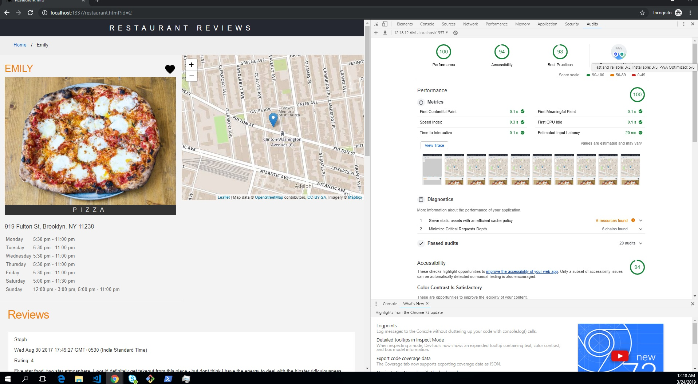

# Running the project

```bash
npm install
npm start
```

Server will start at port `http://localhost:1337/`

## Chrome Audit Results

| Criteria            | Index Page | Restaurant-info Page |
| ------------------- | ---------- | -------------------- |
| Performance         | 100        | 100                  |
| Accessibility       | 94         | 94                   |
| Best Practises      | 93         | 93                   |
| PWA: Fast & Reliable| 3/3        | 3/3                  |
| PWA: Installable    | 3/3        | 3/3                  |
| PWA: Optimized      | 5/6        | 5/6                  |

### Index Page Audit ScreenShot



### Restaurant Info Audit Screenshot



## Project structuring

All the client side code is present in assets file. When the server starts all files from `assests` is moved to `.tmp\public` using gulp. All the assets have the gziped version, done using gulp.

Sails hosts files under `.tmp\public`.

### Client side changes

Updated files to use indexedDB using idb and localstorage to save local changes. `navigator.onLine` is used to detect if you are online or offline
